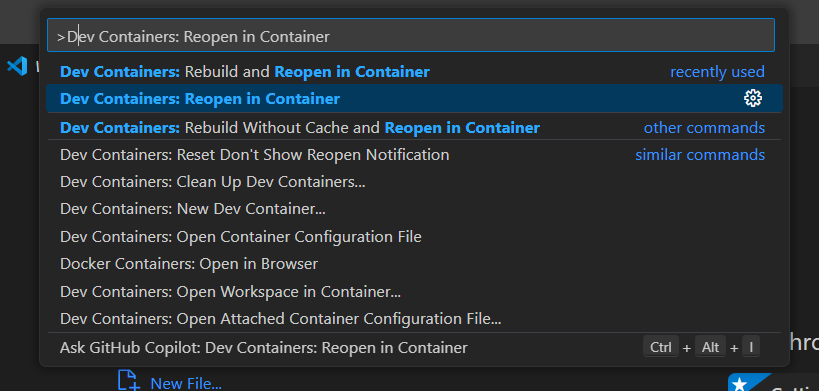
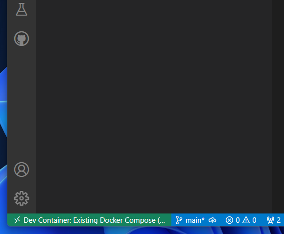
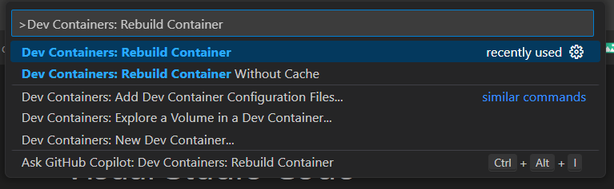
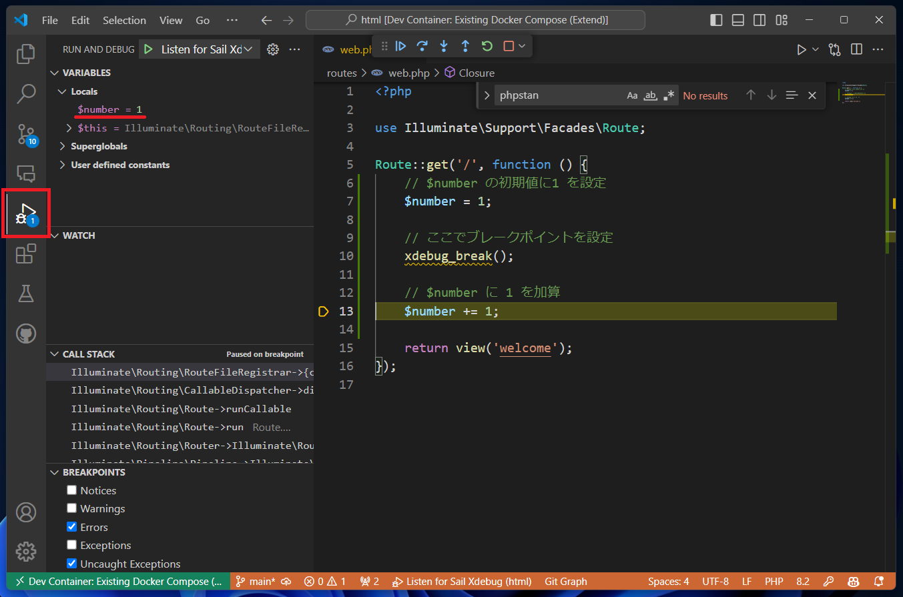
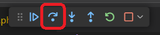
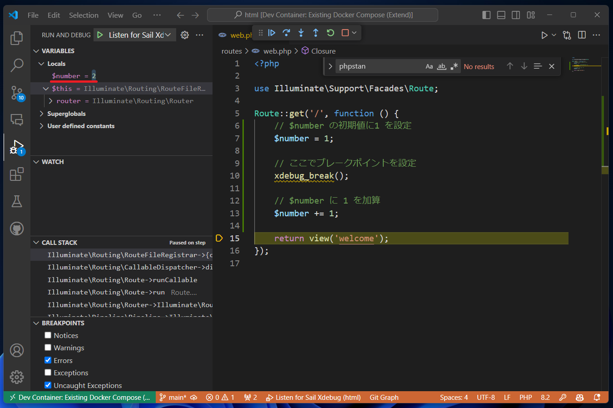
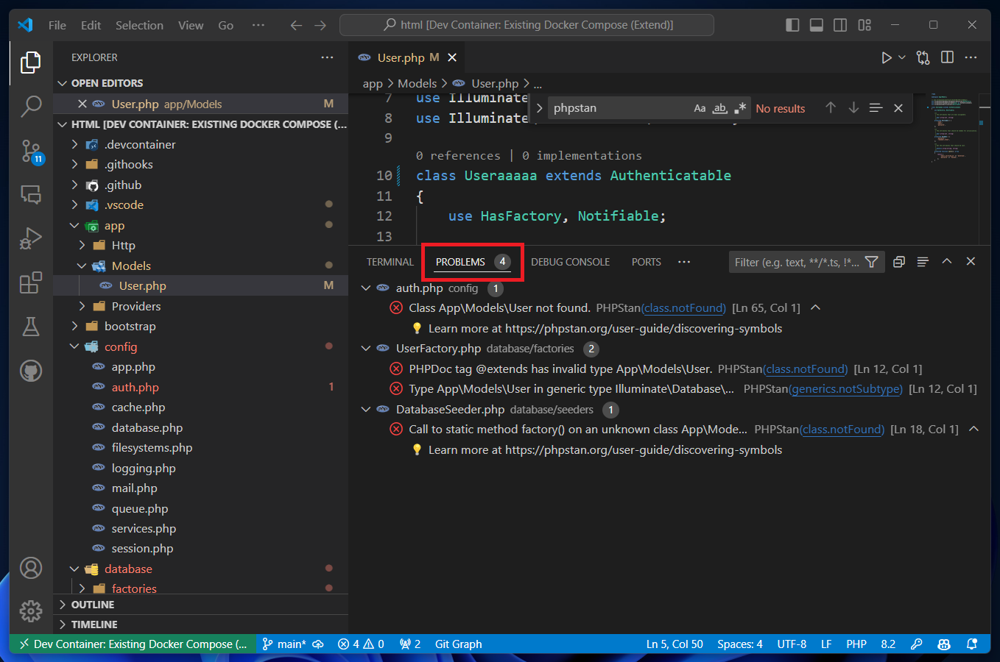
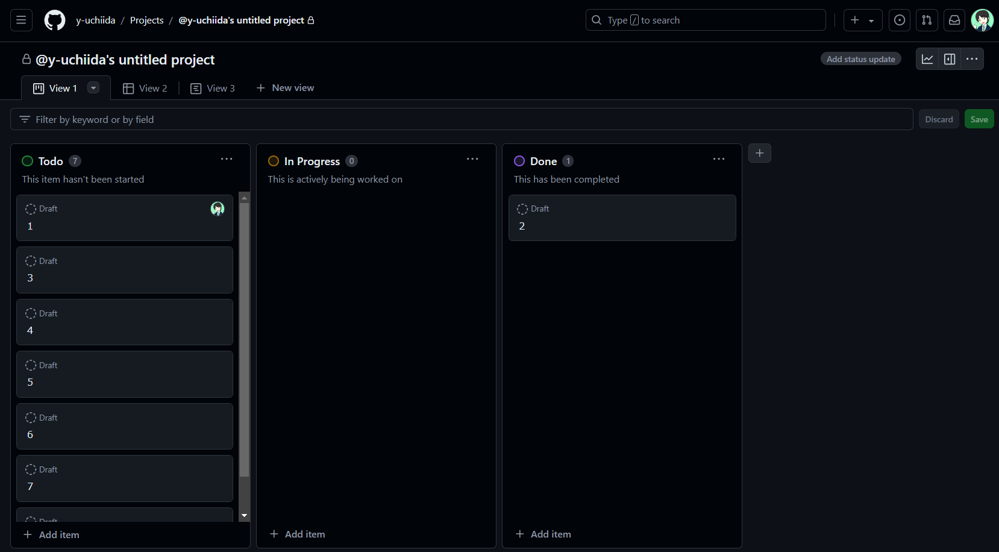
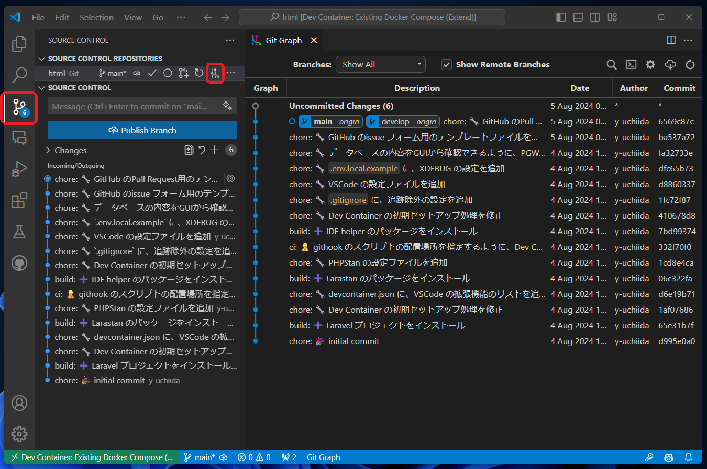
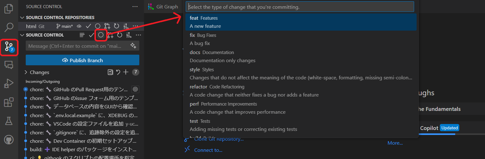

# laravel11-teamproject-example

## 概要

Laravel でチーム開発を行う際のサンプルプロジェクトです。

チーム内で共通化しておきたいリンターやフォーマッターの設定、Xdebugなどを含んだDev Container 環境を提供します。

## 開発環境

本プロジェクトは、以下の環境を必要とします。

### 実行環境

#### Docker Desktop

Dev Container を動作させるために、Dockerのインストールが必要です。  
後述のWSL2 との連携のため、Docker Desktop をインストールしてください。  

<https://docs.docker.com/desktop/install/windows-install/>

#### WSL2 (Windows の場合)

Windows の場合、WSL2 をインストールしてください。  
WSL2 を利用することで、Windows 上で Linux 環境を利用できるようになります。  

<https://apps.microsoft.com/detail/9nz3klhxdjp5?hl=ja-JP&gl=JP>

#### インストールとセットアップの手順詳細

以下のページなどを参考に進めてください。

1. WSL2 のインストール  
   - [WSL を使用して Windows に Linux をインストールする方法](https://learn.microsoft.com/ja-jp/windows/wsl/install)

2. Docker Desktop のインストール
   - [【Docker Desktop】Windowsにインストール（WSL2）](https://chigusa-web.com/blog/windows%E3%81%ABdocker%E3%82%92%E3%82%A4%E3%83%B3%E3%82%B9%E3%83%88%E3%83%BC%E3%83%AB%E3%81%97%E3%81%A6python%E7%92%B0%E5%A2%83%E3%82%92%E6%A7%8B%E7%AF%89/)
     - ページ後半はPython 環境のインストール手順の説明になっていますが、項番5 の`インストール` まで進めればよいです。
     - それ以降も、Docker Desktop の機能や利用方法についてわかりやすく説明されているので、最後までやってみても構いません。
   - [Windowsのための環境構築 Docker Desktop WSL2 バックエンド](https://qiita.com/qvtec/items/b452fc7e98743bbc93b9)
     - 少し内容が古いものの、WSL2 と Docker Desktop の連携について詳しく説明されています。
     - うまくいかない場合に、こちらを参考に設定内容を確認してください。

### コードエディターなど開発用ツール

#### Visual Studio Code

現在、もっともよく利用されているコードエディターのひとつです。  
最新版をインストールしてください。

<https://azure.microsoft.com/ja-jp/products/visual-studio-code>

また、Dev Container の機能を利用するために、以下の拡張機能をインストールしてください。

Dev Containers 拡張機能  
<https://marketplace.visualstudio.com/items?itemName=ms-vscode-remote.remote-containers>

Remote - WSL 拡張機能
<https://marketplace.visualstudio.com/items?itemName=ms-vscode-remote.remote-wsl>

#### Windows Terminal (Windows の場合、推奨)

Windows 用のターミナルアプリケーションです。  
タブ機能や画面分割ができ、PowerShell や WSL2 などのターミナルをまとめて利用できます。

<https://apps.microsoft.com/detail/9n0dx20hk701?SilentAuth=1&wa=wsignin1.0&rtc=1&hl=ja-jp&gl=JP>

## ローカル環境のインストール

ローカル環境のセットアップは、以下の手順で進めてください。

1. Windows Terminal で、WSL2 Ubuntu を起動します

2. 任意のディレクトリに移動し、プロジェクトをクローンします
   ここでは、`~/develop/laravel11-teamproject-example` にクローンする例を示します。

    develop ディレクトリを作成

    ```bash
    mkdir -p ~/develop
    ```

    develop ディレクトリに移動

    ```bash
    cd ~/develop
    ```

    プロジェクトをクローン

    ```bash
    git clone git@github.com:y-uchiida/laravel11-teamproject-example.git
    ```

    SSH の設定を行っていない場合は、代わりにHTTPS のURLを利用します。

    ```bash
    git clone https://github.com/y-uchiida/laravel11-teamproject-example.git
    ```

3. プロジェクトディレクトリに移動します

    ```bash
    cd laravel11-teamproject-example
    ```

4. Visual Studio Code を起動します

    ```bash
    code .
    ```

5. Visual Studio Code から、 Dev Container を実行します

    - `F1` キーを押してコマンドパレットを開きます
    - `Dev Containers: Reopen in Container` と入力して、選択します

    

    - VS Code のウィンドウが開きなおされ、Dev Container のビルドが始まります
    - ビルドが完了すると、Dev Container が起動します
    - 画面左下の緑色のアイコンが、Dev Container の名称になっていれば完了です

    

以降の開発作業は、Dev Container 内で進めていきます。

### 起動したDev Container から、ファイルの追加や保存ができない場合

Dev Container のユーザーパーミッションが適切に設定されず、ファイルの編集ができなくなるケースがあります。  
この事象は、ホスト側(WSL2) で利用しているユーザーのIDと、Dev Container 内で利用しているユーザーのID が異なる場合に発生します。

IDが異なる場合、コンテナ内で`ls` コマンドを実行すると、ユーザー名ではなくユーザーID が表示されます。

```bash
ls -lsa
total 452
  4 drwxr-xr-x 17 1002 1002   4096 Aug  4 12:55 .
  4 drwxr-xr-x  3 root root   4096 Jul 16 09:22 ..
  4 drwxr-xr-x  2 1002 1002   4096 Aug  4 07:43 .devcontainer
  4 -rw-r--r--  1 1002 1002    258 Jul 16 14:39 .editorconfig
  4 -rw-r--r--  1 1002 1002   1380 Aug  4 07:40 .env
  4 -rw-r--r--  1 1002 1002   1077 Aug  4 03:16 .env.example
  4 -rw-r--r--  1 1002 1002   1380 Aug  4 08:19 .env.local.example

  # 以下省略
```

`.env` に、コンテナ内で利用するユーザーIDを設定する項目が用意されているので、以下の手順でユーザーID を設定してください。

1. ホスト側(WSL2) のユーザーID の確認

    以下のコマンドで、ホスト側(WSL2) のユーザーID を確認します

    ```bash
    id -u
    ```

    ユーザーIDが数値で出力されます

    ```bash
    # 出力例
    1000
    ```

2. `.env` ファイルを編集します  

    `WWWGROUP` と `WWWUSER` に、先ほどのコマンドで出力されたユーザーID を設定します

    ```diff
    - WWWGROUP=1002
    - WWWUSER=1002
    + WWWGROUP=1000
    + WWWUSER=1000
    ```

3. `.env` ファイルを保存し、Dev Container を再起動します

    - `F1` キーを押してコマンドパレットを開きます
    - `Dev Containers: Rebuild Container` と入力して、選択します

    

    - VS Code のウィンドウが開きなおされ、Dev Container の再ビルドが始まります

4. ユーザーIDの設定を確認します

Dev Container が再起動したら、以下のコマンドでユーザーID が正しく設定されていることを確認してください。

```bash
id -u
```

ユーザーIDが、先ほど設定した数値と一致していれば成功です。

```bash
# 出力例
1000
```

また、`ls` コマンドを実行して、ユーザー名 `sail` が正しく設定されていることを確認してください。

```bash
ls -lsa
total 452
  4 drwxr-xr-x 17 sail sail   4096 Aug  4 12:55 .
  4 drwxr-xr-x  3 root root   4096 Jul 16 09:22 ..
  4 drwxr-xr-x  2 sail sail   4096 Aug  4 07:43 .devcontainer
  4 -rw-r--r--  1 sail sail    258 Jul 16 14:39 .editorconfig
  4 -rw-r--r--  1 sail sail   1380 Aug  4 07:40 .env
  4 -rw-r--r--  1 sail sail   1077 Aug  4 03:16 .env.example
  4 -rw-r--r--  1 sail sail   1380 Aug  4 08:19 .env.local.example

  # 以下省略
```

このように、ユーザー名 `sail` が表示されていれば、ファイルの編集が可能になります。

### デバッグについて

本リポジトリのDev Container には、Xdebug が導入されています。  

Xdebug を利用することで、プログラムの処理をステップ実行したり、変数の値を確認したりすることができます。

以下では、`http://localhost` にアクセスした際にXdebug でデバッグを行う手順を説明します。

1. ブレークポイントを設定する
    今回は簡易的に、`routes/web.php` の`/` にブレークポイントを設定します。

    ```php
    Route::get('/', function () {
        // $number の初期値に1 を設定
        $number = 1;

        // ここでブレークポイントを設定
        xdebug_break();

        // $number に 1 を加算
        $number += 1;

        return view('welcome');
    });
    ```

2. デバッグの開始
    ブレークポイントを設定した後、`F5` キーを押してデバッグを開始します。  

    なお、デバッグのためのランチャー設定は`.vscode/launch.json` に記述されているため、特に設定は不要です。

3. ブラウザでアクセス
    ブラウザで`http://localhost` にアクセスします。

4. デバッグビューの表示

    - デバッグの操作は、VS Code のデバッグビューで行います。
    - デバッグビューは、左側のアイコンからアクセスできます。

    

    この時点で、ルーティングの関数内で定義した変数 `$number` が `1` であることが確認できます。

5. ステップ実行

    - `F10` キーを押して、ステップ実行を行います。
    - または、画面に表示されたデバッグコントロールの`Step over`ボタンをクリックしてもステップ実行が行えます。

    

    この操作で、変数 `$number` が `2` に変更されることが確認できます。

    

Xdebug の機能を活用することで、効率的にデバッグ作業を行うことができます。活用してください。

### コーディング規約について

原則として、Laravel が採用しているコーディング規約に従って開発を行います。  

本リポジトリのDev Container には、[DEVSENSE PHP Tools for Visual Studio Code](https://marketplace.visualstudio.com/items?itemName=DEVSENSE.phptools-vscode) という拡張機能がインストールされています。  

この拡張機能は、PHP のコーディング規約に従ってコードを自動整形する機能を提供します。  

特に意識していなくても、この拡張機能が自動的にコードを整形してくれるため、コーディング規約に従ったコードを書くことができます。

#### コーディング規約のチェックツール

本リポジトリのDev Containerには、PHPコードの静的解析ツールとして[Larastan](https://github.com/larastan/larastan) を導入しています。  

以下のコマンドで、コーディング規約のチェックを行うことができます。

```bash
./vendor/bin/phpstan analyse --memory-limit=1G
```

以下のように表示された場合、コーディング規約に違反している箇所がある可能性があります。

```bash
 ------ --------------------------------------------------------------------- 
  Line   config/auth.php                                                      
 ------ --------------------------------------------------------------------- 
  :65    Class App\Models\User not found.                                     
         💡 Learn more at https://phpstan.org/user-guide/discovering-symbols  
 ------ --------------------------------------------------------------------- 

 ------ ------------------------------------------------------------------------------------------------------------------------------------ 
  Line   database/factories/UserFactory.php                                                                                                  
 ------ ------------------------------------------------------------------------------------------------------------------------------------ 
  :12    PHPDoc tag @extends has invalid type App\Models\User.                                                                               
  :12    Type App\Models\User in generic type Illuminate\Database\Eloquent\Factories\Factory<App\Models\User> in PHPDoc tag @extends is not  
         subtype of template type TModel of Illuminate\Database\Eloquent\Model of class Illuminate\Database\Eloquent\Factories\Factory.      
 ------ ------------------------------------------------------------------------------------------------------------------------------------ 

 ------ ---------------------------------------------------------------------- 
  Line   database/seeders/DatabaseSeeder.php                                   
 ------ ---------------------------------------------------------------------- 
  :18    Call to static method factory() on an unknown class App\Models\User.  
         💡 Learn more at https://phpstan.org/user-guide/discovering-symbols   
 ------ ---------------------------------------------------------------------- 

                                                                                                                        
 [ERROR] Found 4 errors                                                                                                 
```

エラーが検出されなかった場合は、以下のように表示されます。

```bash
 [OK] No errors  
```

なお、phpstan のVSCode 拡張機能も導入しているので、エディター上でエラーを確認することもできます。



さらに、Git の機能で、コミット実行前にLaraStan での静的解析を自動実行し、エラーがある場合はコミットが行われないように設定しています。  

これにより、コーディング規約に違反したコードがコミットされることを防ぐことができます。

#### 補足1: PSR について  

PSR　(Php Standard Recommendation) は、PHP のコーディング規約を定めた文書です。  
PHP の開発グループが制定しているものではなく、PHP-FIG という団体が議論・策定しています。  
必ずしもPSRに準拠する必要があるようなものではありませんが、近年では多くのフレームワークやライブラリが少なからずPSRに影響を受けているので、一般的なルールといえると思います。  

詳しく知りたい場合は、以下のページを確認してください。

- [【PHP】PSR-2 Coding Style Guide（コーディングスタイルガイド）](https://www.ritolab.com/posts/92)
- [PSR-12 拡張コーディングスタイル（日本語訳）](https://zenn.dev/aki_artisan/articles/psr12-translation-ja)
- [https://hackmd.io/@E6hhS-xhQIqrpKokpl_yQQ/SyT9ePHru](https://hackmd.io/@E6hhS-xhQIqrpKokpl_yQQ/SyT9ePHru)
- [PSRとコーディングスタイルの関係、そしてPERへ](https://qiita.com/tadsan/items/4c8e22dc133cd45f3999)

#### 補足2: PSRで厳密に定義されていないルールについて

PSR は相互運用性を目的としており、厳密に定義されていないルールもあります。  
たとえば、変数名のケーシングについて、PSR-1 では以下のように述べています。

> このガイドでは、`$StudlyCaps`、`$camelCase`、または`$under_score` 形式のプロパティ名の使用に関する推奨を意図的に避けています。
>
> どのような命名規則であれ、妥当な範囲内で一貫して適用されるべきです (SHOULD)。その範囲は、ベンダレベル、パッケージレベル、クラスレベル、メソッドレベルです。

以下、y-uchiida の個人的な方針としては以下のようにしています。

- クラス内のメソッド名およびプロパティ名、変数名は、`camelCase` 形式を採用する
- メソッド名は、動詞で始める
- プロパティ名および変数名は、名詞にする
- データベースのテーブル名およびカラム名は、`snake_case` 形式を採用する

### 開発作業の分担と進捗共有

#### issue の作成について

プログラムの実装作業は、GitHub の Issue を利用して管理します。  
作業内容や進捗状況を共有するために、Issue を作成し、作業を進めてください。

Issue は、以下のページから作成できます。
<https://github.com/y-uchiida/laravel11-teamproject-example/issues/new>

issue は項目ごとに入力欄を分けてあります。それぞれの項目について、わかりやすく記入してください。

#### タスク管理と作業状況の確認

作業の分担と進捗の確認については、GitHub の Project を利用します。  
以下のProject にサンプルを設定しています。
<https://github.com/users/y-uchiida/projects/4>  



上記 URL からアクセスできない場合は、@y-uchiida までご連絡ください。  
閲覧権限を付与します。

### ブランチとコミット履歴の確認方法

本リポジトリのDev Container には、[Git Graph](https://marketplace.visualstudio.com/items?itemName=mhutchie.git-graph) という拡張機能がインストールされています。  
`Git Graph` は、VS Code で Git のコミット履歴をグラフィカルに表示するための拡張機能です。  

サイドバーの`Source Control` タブを開き、`Git Graph`のアイコンをクリックすると、Git Graphの画面が表示されます。



### コミットメッセージのフォーマットについて

コミットメッセージは、`Conventional Commits` のフォーマットに従って記述してください。  
`Conventional Commits` は、コミットメッセージのフォーマットを統一するための規約です。

詳細は以下のページを参照してください。

- [Conventional Commits](https://www.conventionalcommits.org/ja/v1.0.0/)
- [コミットメッセージ規約 「Conventional Commits」を導入してみよう！ / Let's use Conventional Commits](https://speakerdeck.com/cocoeyes02/lets-use-conventional-commits)
- [[かんたんコミットメッセージ] Conventional Commits で使用可能な prefix の解釈](https://qiita.com/shisotem/items/8f8e11a426450828e5b7)

#### コミットメッセージ作成を支援する拡張機能

本リポジトリのDev Container には、[Conventional Commits](https://marketplace.visualstudio.com/items?itemName=vivaxy.vscode-conventional-commits) という拡張機能がインストールされています。  
`Conventional Commits` 拡張機能は、`Conventional Commits` のフォーマットに基づいたコミットメッセージを対話形式で作成するための拡張機能です。  

以下の手順で利用できます。

1. `F1` キーを押してコマンドパレットを開きます
2. `Conventional Commits` と入力して、選択します
3. コミットの種別を選択してEnter キーを押します
4. コミットのスコープを選択してEnter キーを押します
5. コミットメッセージに含めるemoji (gitmoji)を選択してEnter キーを押します
6. コミットの概要を入力してEnter キーを押します
7. コミットの詳細を入力してEnter キーを押します
8. 破壊的変更がある場合は、その内容を入力してEnter キーを押します
9. コミットメッセージが作成されます

もしくは、`Source Control` タブを開き、`Conventional Commits` のアイコンをクリックすることでも、対話形式でコミットメッセージを作成できます。



使用方法の詳細は以下のページを参照してください。

- [Conventional Commits - Visual Studio Marketplace](https://marketplace.visualstudio.com/items?itemName=vivaxy.vscode-conventional-commits)

### マージ・レビューについて

開発メンバーは、それぞれ git ブランチをわけてタスクを実装することを想定しています。  
リモートリポジトリにプッシュした後、 `develop` ブランチ宛にプルリクエスト を作成し、他メンバーからのレビューを受けてください。

レビューを行った人は、実装に問題がなくマージ可能と思ったら、`Apprve` を選択してレビューコメントを作成してください。  
修正が必要と思われる個所がある場合は、`Request changes` を選択してレビューコメントを作成し、修正を依頼してください。  

マージは、原則としてレビューを行った人が行います。
